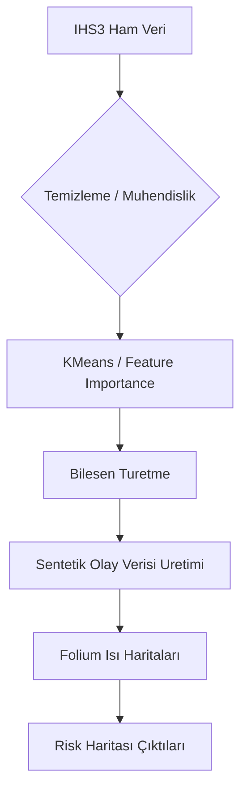

# 🌍 Malawi Risk Data Generator

**Sentetik Veri Üretimi ve Canlı Risk Haritalama için Temel Veri Boru Hattı**

Bu proje, **Malawi Third Integrated Household Survey (IHS3, 2010–2011)** verilerini temel alarak **risk temelli coğrafi modelleme** için sentetik veri üretimi sağlar.

Amacımız, sosyoekonomik ve çevresel faktörleri temel alarak **sel, hava kirliliği, bebek ölümü, tarımsal verim düşüşü ve trafik kazaları** gibi kritik olayları modellemek ve bu olayların **coğrafi dağılımlarını harita üzerinde görselleştirmektir.** Oluşturulan bu temel veri boru hattı (**pipeline**), canlı risk tahmin sistemlerinin prototiplenmesi için genellenebilir, etik ve açık bir alternatif sunar.

---

## 🎯 Projenin Amacı ve Motivasyonu

Gerçek dünya verileri (özellikle hanehalkı mikro verileri) çoğu zaman **eksik, sınırlı erişilebilir** veya **mahremiyet kısıtlamalarına** tabidir. Bu durum, özellikle gelişmekte olan bölgelerde (Malawi gibi) coğrafi bilgi sistemleri (GIS) tabanlı araştırma ve prototiplemeyi zorlaştırır.

Bu nedenle proje, **Malawi IHS3** anketinden elde edilen istatistiksel dağılımları ve yapısal ilişkileri referans alarak **sentetik ancak tutarlı** veri kümeleri oluşturur.

Bu sentetik taban verisi:
- Gerçek zamanlı veya canlı sensör verileriyle entegre edilebilecek **risk tahmin modellerinin** temelini oluşturur.
- **Coğrafi bilgi sistemleri (GIS)** ve **makine öğrenimi** çözümleri için senaryo bazlı, büyük ölçekli örnekler sağlar.
- **Eğitim, araştırma ve yapay zeka prototipleme** ortamlarında gerçek veri yerine kullanılabilecek, **açık ve etik** bir alternatiftir.

---

## 🧠 Veri Kaynağı ve Bilimsel Dayanak

### Temel Referans Veri
> **National Statistical Office (NSO), Malawi.** *Third Integrated Household Survey (IHS3), 2010–2011* > [World Bank Microdata Library – DOI: 10.48529/W1JQ-QH85](https://doi.org/10.48529/W1JQ-QH85)

Bu kapsamlı anket, 2010–2011 yılları arasında Malavi genelinde yürütülmüş, **hanehalkı, eğitim, sağlık, tarım, gelir, çevre ve altyapı** göstergelerini içeren bir mikro veri çalışmasıdır.

Proje, bu anket verisindeki temel yapısal ilişkileri (ör. gelir–sağlık, tarım–yağış, hane büyüklüğü–bebek ölümleri) temel alarak **istatistiksel model tabanlı sentetik varyasyonlar** üretmektedir.

---

## 📊 Modelleme ve Üretim Süreci

Sentetik verinin oluşturulması ve haritalanması, aşağıdaki adımları içeren modüler bir boru hattı üzerinden ilerler:


## 📍 Görselleştirmeler

Proje kapsamında üretilen etkileşimli haritalar ve görseller GitHub Pages üzerinden görüntülenebilir:

- 🗺️ [Basit Isı Haritası (Heatmap Simple)](https://09eesx.github.io/malawi_synthetic_data_pipeline/data/output/heatmap_simple.html)
- 🌡️ [Ağırlıklı Isı Haritası (Heatmap Weighted)](https://09eesx.github.io/malawi_synthetic_data_pipeline/data/output/heatmap_weighted.html)
- 🔵 [Küme Tabanlı Isı Haritası (Cluster Heatmap)](https://09eesx.github.io/malawi_synthetic_data_pipeline/data/output/heatmap_clusters.html)

Ek olarak:
- 🧩 [Özellik Önem Grafiği (Feature Importance)](https://09eesx.github.io/malawi_synthetic_data_pipeline/data/output/feature_importance.png)
- 📊 [Tüm Üretilmiş CSV Verileri](https://github.com/09eesx/malawi_synthetic_data_pipeline/tree/main/data/output)

---
---

## 🚀 Ana Özellikler

* 🇲🇼 **Malawi IHS3 Tabanlı Model:** Sentetik veriler, gerçek hanehalkı anketinin istatistiksel dağılımlarına uygundur.
* 🗺️ **Coğrafi Simülasyon:** Sel, hava kalitesi, bebek ölümü, trafik kazaları gibi risk olaylarının coğrafi dağılımının simülasyonu.
* 🧮 **Makine Öğrenimi Entegrasyonu:** `RandomForest` ile değişken önem sıralaması ve `KMeans` ile bölgesel kümeleme analizi.
* 📈 **Türetilmiş Özellikler:** Alan, nüfus yoğunluğu, tarım oranı gibi kritik coğrafi ve sosyoekonomik özelliklerin hesabı.
* 🔥 **Canlı Görselleştirme:** **Folium HeatMap** ile etkileşimli, katmanlı risk bölgeleri haritalaması.
* 🕒 **Zaman Serisi Yeteneği:** Sentetik olay verileri (ör. trafik kazaları), tarih ve açıklama gibi zaman serisi bileşenleri içerir.
* ⚙️ **Otomatik Pipeline:** Veri üretimi, modelleme ve harita çıktılarının tamamı tek bir komutla çalışabilen otomatik bir yapıdadır.

---

## 🧩 Kullanılan Teknolojiler

| Teknoloji | Kullanım Amacı |
| :--- | :--- |
| **Pandas, NumPy** | Veri işleme, temizleme ve sentetik örnek üretimi |
| **Scikit-Learn** | Kümeleme (`KMeans`) ve değişken önemi (`RandomForest`) analizi |
| **Folium** | Coğrafi ısı haritaları ve etkileşimli görselleştirmeler |
| **Matplotlib / Seaborn** | Grafikler ve değişken önem sıralamaları |
| **Datetime / Random** | Olay zamanlamaları ve rastgele varyasyonların oluşturulması |

---

## ⚙️ Kurulum

Projeyi yerel makinenize klonlayın ve bağımlılıkları yükleyin:

```bash
git clone [https://github.com/09eesx/malawi_risk_data_generator.git](https://github.com/09eesx/malawi_risk_data_generator.git)
cd malawi_risk_data_generator
pip install -r requirements.txt
```

---

## ▶️ Kullanım

### 1️⃣ Pipeline'ı Çalıştırma

Projenin ana boru hattını çalıştırmak için:

```bash
python -m main
```

### 2️⃣ Üretilen Çıktılar

Tüm üretilen sentetik veri kümeleri ve görselleştirme çıktıları (`.csv`, `.html`, `.png` formatlarında) otomatik olarak `data/output/` klasörüne kaydedilir.

| Dosya Adı | Açıklama |
| :--- | :--- |
| `sentetik_flood_data.csv` | Sel ve çevresel risk bileşenleri içeren sentetik veri |
| `sentetik_health.csv` | Sağlık merkezleri ve bebek ölümü göstergeleri |
| `sentetik_air.csv` | Sentetik hava kalitesi verileri (`AQI` tahminleri) |
| `pop_counts.csv` | Cluster bazlı nüfus yoğunluğu tahminleri |
| `heatmap_weighted.html` | Ağırlıklı risk yoğunluğunu gösteren etkileşimli harita (Ana Çıktı) |
| `feature_importance.png` | RandomForest'tan elde edilen değişken önem sıralaması görseli |

---

---


---

## 🧩 Proje Yapısı

```
malawi_risk_data_generator/
│
├── main.py
├── README.md
│
├── modules/                               # Tüm veri üretim ve modelleme modülleri
│   ├── clustering.py                      # KMeans ve değişken önem analizi
│   ├── incidents_generator.py             # Trafik, sel, bebek ölümü gibi olayları üretir
│   ├── heatmap_generator.py               # Folium haritalarını oluşturur
│   └── ... (diğer bileşenler)
│
└── data/
    ├── raw/
    │   └── df_final_merged_MWI.csv        # Referans alınan hanehalkı verisi (anonimleştirilmiş)
    └── output/
        ├── sentetik_*.csv                 # Tüm üretilen sentetik veriler
        ├── heatmap_*.html                 # HTML formatında haritalar
        └── feature_importance.png
```

---

## 📜 Lisans ve Etik Kullanım

Bu proje **MIT Lisansı** ile lisanslanmıştır.

> **Önemli Not:** Kaynak veriler, [World Bank LSMS Microdata Library](https://microdata.worldbank.org/) kapsamında açık olarak erişilebilir olsa da, **bu projede kullanılan veriler sentetik olarak üretilmiştir** ve orijinal anket katılımcılarını doğrudan temsil etmez. Etik kullanım ve mahremiyet gözetilmiştir.

---

## 👩‍💻 Geliştirici

**Esma Elifsu Cerit**
🎓 Yapay Zekâ Mühendisliği | 🧠 Coğrafi Veri Modelleme | 🌍 Risk Haritalama
📫 [github.com/09eesx](https://github.com/09eesx)
